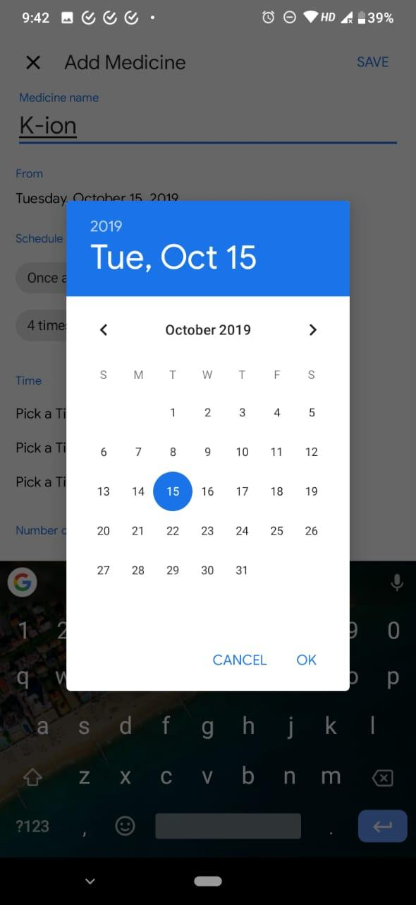
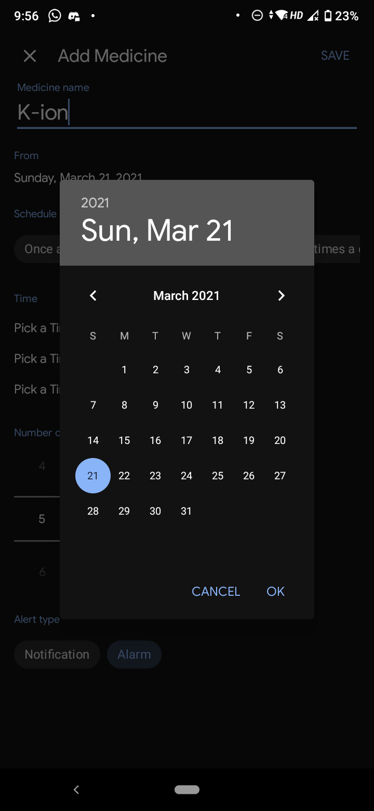
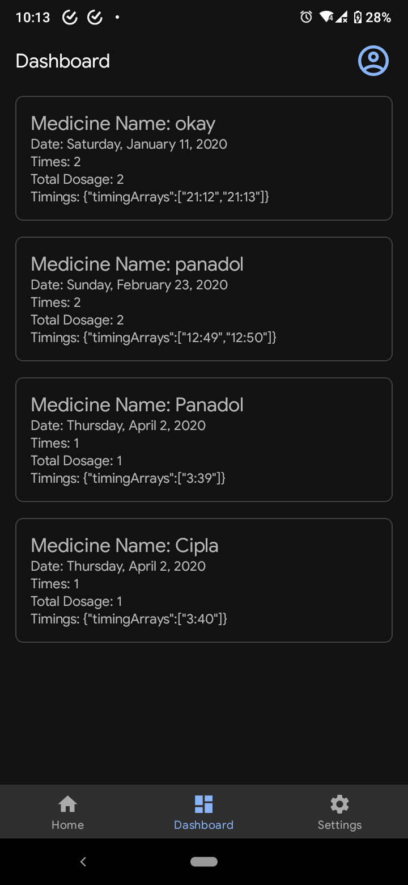

# MyTherapy Backend

## Description
MyTherapy Backend is a RESTful API for managing therapy-related workflows such as
patients, therapists, appointments, and treatment notes.
This project demonstrates backend development best practices with Java and Spring Boot,
including secure access, clean architecture, and database integration.

---

## Tech Stack
- Java 17
- Spring Boot
- Spring Security (JWT)
- PostgreSQL
- Hibernate / JPA
- Maven
- Swagger (OpenAPI)
- JUnit (basic)

---

## Features
- User authentication and authorization (JWT)
- Manage patients and therapists (CRUD)
- Appointment scheduling (create/update/cancel)
- Treatment notes / records management
- Input validation and global exception handling
- Pagination and sorting for listing endpoints

---

## Architecture
Controller → Service → Repository  
DTO pattern is used for data transfer.

---

## API Documentation
Swagger UI is available after running the application locally:

http://localhost:8080/swagger-ui.html

---

# Med-Dose

A Medicine Dosage Reminder App built using native Android in Java.

## Screenshots








---

## How to Run
```bash
mvn clean install
mvn spring-boot:run
